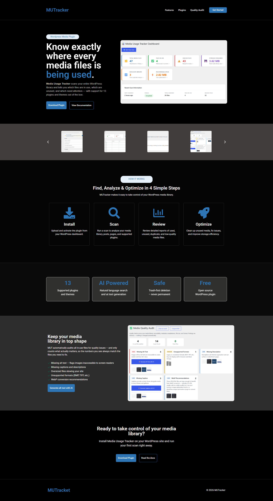
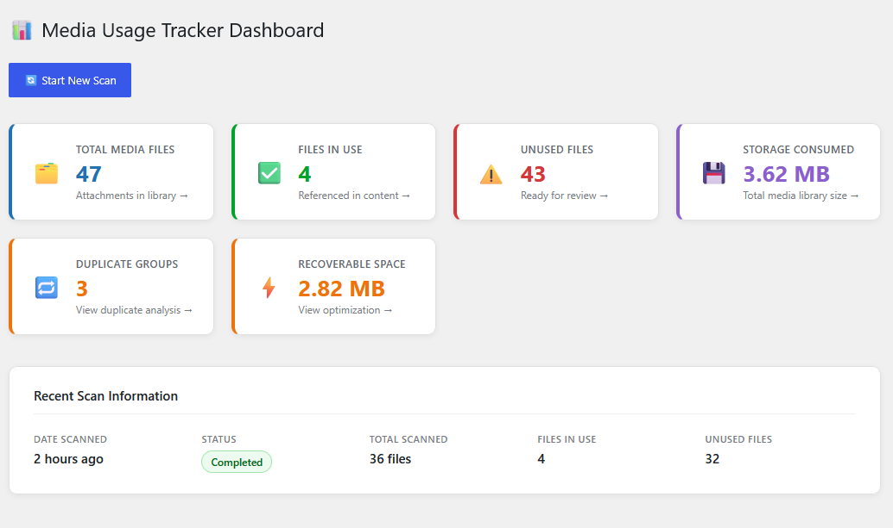
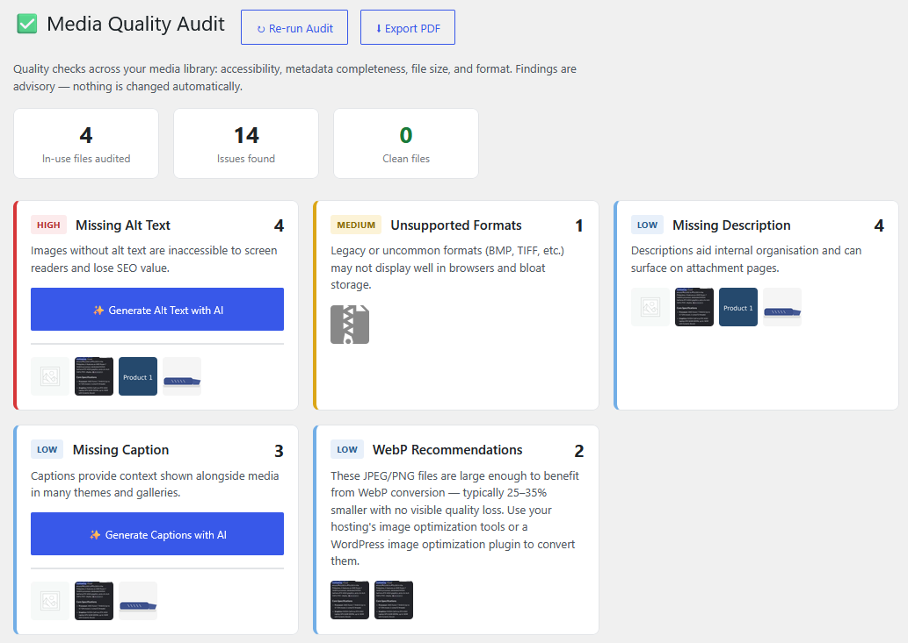

# Media Usage Tracker

> A WordPress plugin that scans your media library, identifies where files are used, detects unused media, finds duplicates, and helps improve media quality.

Media Usage Tracker helps WordPress administrators understand exactly how media files are being used across posts, pages, themes, and supported plugins. It identifies unused files, duplicate assets, and media quality issues to help optimize storage and improve site performance.

## Features

- Media usage tracking
- Unused media detection
- Duplicate file detection
- AI-powered alt text generation
- Media quality audits
- Storage optimization recommendations

## Installation

1. Download the plugin ZIP file.
2. Go to WordPress Admin → Plugins → Add New.
3. Click Upload Plugin and select the ZIP file.
4. Activate the plugin.
5. Open Media Usage Tracker from the WordPress dashboard.

## How It Works

### 1. Install
Upload and activate the plugin from your WordPress dashboard.

### 2. Scan
Run a scan to analyze your media library, posts, pages, and supported plugins.

### 3. Review
Review detailed reports of used, unused, duplicate, and low-quality media files.

### 4. Optimize
Clean up unused media and improve storage efficiency.

## Supported Features

- Media Library Analysis
- Duplicate Detection
- Accessibility Checks
- Missing Alt Text Detection
- AI Recommendations
- Quality Audit Reports

## Roadmap

### v1.0
- Media Usage Tracking
- Unused Media Detection
- Media Quality Audit

### v1.1
- Scheduled Scans
- CSV Export

### v1.2
- WooCommerce Support
- Elementor Widget Detection

### v2.0
- AI Cleanup Recommendations
- Smart Optimization Suggestions

## License

MIT License

## Screenshots

### Landing Page

### Dashboard

### Media Quality Audit

